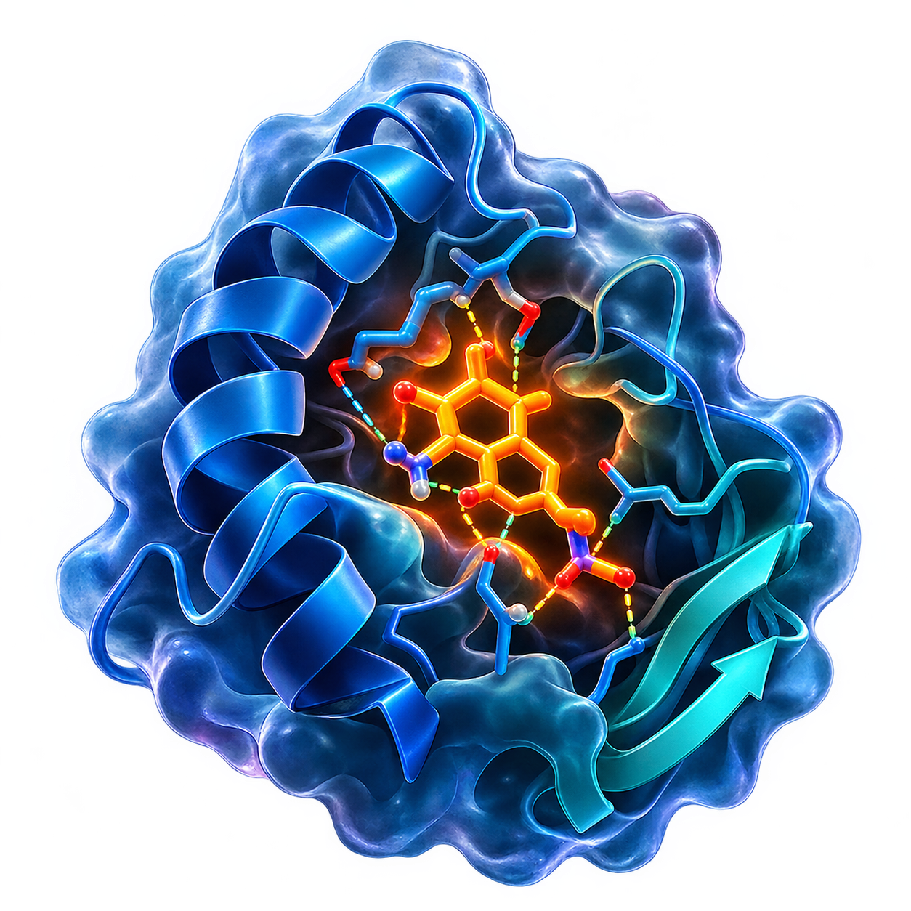

# PLIP Studio

A simple desktop tool for protein–ligand interaction analysis with a
guaranteed PyMOL session (`.pse`) export.

You give it a protein and a ligand — it gives you back a `.pse` file you can
open directly in PyMOL, plus CSV tables of every interaction.



---

## What it does

1. Takes a **protein** + **ligand** (separate files) or one **complex** PDB.
2. Converts the ligand to PDB with OpenBabel if needed.
3. Cleans the complex (ligand becomes HETATM, waters/buffers removed).
4. Runs [PLIP](https://plip-tool.biotec.tu-dresden.de/) for the analysis.
5. Builds a PyMOL `.pse` session from the results — ligand, binding site and
   every interaction drawn as coloured dashed lines.

No command line needed. One window, three fields, one button.

---

## Installation

```bash
pip install plip openbabel lxml pymol-open-source
```

Then run:

```bash
python plip_studio.py
```

On Windows, if `tkinter` is missing, reinstall Python from
[python.org](https://www.python.org/downloads/) and check
**"tcl/tk and IDLE"** in the installer.

---

## How to use

1. Pick **protein** and **ligand** files (or one ready complex).
2. Pick an output folder.
3. Click **Analyze and save PyMOL session**.
4. Open the generated `.pse` in PyMOL.

---

## 🎨 Interaction colours in the `.pse`

Every interaction is drawn as a **dashed line** between the ligand and the
protein (or water). The colour tells you what kind of interaction it is:

| Colour | Appearance | Interaction type |
|---|---|---|
| 🔵 **Blue** | dark blue dashes | **Hydrogen bonds** |
| ⚫ **Gray** | mid-gray dashes | **Hydrophobic contacts** |
| 🟡 **Yellow** | bright yellow dashes | **Salt bridges** |
| 🟣 **Magenta** | pink/magenta dashes | **π–π stacking** |
| 🟠 **Orange** | orange dashes | **π–cation interactions** |
| 🩵 **Light blue** | pale blue dashes | **Water bridges** (two segments: ligand–water and water–protein) |
| 🟢 **Teal** | dark cyan dashes | **Halogen bonds** |
| 🟪 **Violet** | purple dashes | **Metal complexes** |

### Ligand and binding site

| Element | Colour |
|---|---|
| **Ligand** carbons | 🟠 Orange |
| **Ligand** oxygen / nitrogen / sulfur | 🔴 Red / 🔵 Blue / 🟡 Yellow |
| **Binding-site residues** carbons | 🩵 Cyan |
| **Binding-site** oxygen / nitrogen / sulfur | 🔴 Red / 🔵 Blue / 🟡 Yellow |

All dashes are grouped under an object called **`Interactions`** in the PyMOL
session panel, so you can toggle each interaction type on or off individually.

---

## Output files

Each run creates its own folder:

```
PLIP_Results/
└── run_20250101_143012/
    ├── run_20250101_143012.pse              ← open in PyMOL
    ├── run_20250101_143012_complex.pdb
    ├── run_20250101_143012.xml              ← PLIP report
    ├── run_20250101_143012.txt              ← PLIP report
    ├── run_20250101_143012_interactions.csv
    ├── run_20250101_143012_binding_site_residues.csv
    ├── run_20250101_143012_ligand_properties.csv
    ├── run_summary.txt
    └── PLIPStudio_LOG.txt
```

---

## Command line (optional)

If you prefer running it without the GUI:

```bash
python plip_studio.py --headless \
    --protein receptor.pdb \
    --ligand  ligand.pdbqt \
    --out     ./results
```

Useful flags:

| Flag | Meaning |
|---|---|
| `--protein` `--ligand` | Two-file mode |
| `--complex` | One-file mode |
| `--out` | Output folder |
| `--threads N` | PLIP worker threads |
| `--keep-waters` | Do not strip waters |

---

## Requirements

- Python 3.9 or newer
- `plip`, `openbabel`, `lxml`, `pymol-open-source`

---

## Citation

PLIP Studio is a front-end for **PLIP**. If you use it in a paper, please cite:

> Adasme MF, Linnemann KL, Bolz SN, Kaiser F, Salentin S, Haupt VJ,
> Schroeder M. **PLIP 2021: expanding the scope of the protein–ligand
> interaction profiler to DNA and RNA.** *Nucleic Acids Research* 49(W1),
> W530–W534, 2021. doi: [10.1093/nar/gkab294](https://doi.org/10.1093/nar/gkab294)

---

## License

MIT
